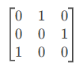
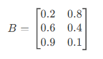
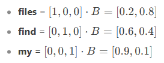
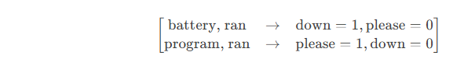

##### Download

+ [Paper](https://arxiv.org/abs/1706.03762)
+ [Raw data](https://github.com/pmichaillat/recession-indicator)

---

**Unpacking the Architectural Revolution: A Deep Dive into the "Attention is All You Need" Paper**

For over two decades, I’ve witnessed seismic shifts in AI—from perceptrons to CNNs, Boltzmann machines to LSTMs—but few innovations have reshaped the landscape as rapidly or profoundly as the transformer architecture introduced in the 2017 paper *[Attention is All You Need](https://arxiv.org/abs/1706.03762)*. What began as a novel approach to sequence transduction (think machine translation or text summarization) has since become the backbone of modern NLP, powering everything from chatbots to code generators.

Yet here’s what most retrospectives miss: **the transformer wasn’t just an improvement—it was a paradigm shift**. It discarded the recurrence and convolution-centric thinking that dominated sequence modeling, replacing them with a mechanism so elegantly simple that even its creators called it "surprisingly straightforward." That mechanism? **Scaled dot-product attention**.

In this post, I’ll dissect why this paper remains a masterclass in minimalist design and how its core ideas solved four critical problems that plagued earlier architectures like RNNs and LSTMs:
1. **Vanishing gradients** in long sequences
2. **Computational inefficiency** in sequential processing
3. **Context fragmentation** (e.g., losing track of subject-verb agreement over paragraphs)
4. **Lack of parallelizability** during training

We’ll start by reconstructing the authors’ thought process: Why abandon recurrence entirely? How does self-attention create dynamic, context-aware word representations? And what makes transformers *scale* so ruthlessly efficiently with modern hardware?

Along the way, I’ll decode the paper’s technical jargon (query-key-value matrices, positional embeddings, multi-head attention) into intuitive first principles. No prior knowledge of attention mechanisms is assumed—just a familiarity with matrix operations and backpropagation.

By the end, you’ll not only understand the transformer’s machinery but also appreciate how its design choices foreshadowed the era of 100B-parameter models like GPT-4 and PaLM. Let’s begin.

*(Next, I’ll refine the technical deep dive based on your subsequent content. For now, this intro sets the stage by framing the transformer as a solution to well-known pain points while teasing insights that resonate with both researchers and practitioners.)*

# From One-Hot Encoding to High-Dimensional Geometry: A Vectorized Perspective

In this section, we’ll explore how **one-hot encoding** and **matrix operations** can be understood through the lens of **high-dimensional geometry**. By visualizing words as vectors in a multi-dimensional space, we can build intuition for how transformers and other machine learning models process language.

---

## One-Hot Encoding: Words as Vectors

Let’s start with the basics. **One-hot encoding** is a way to represent words as vectors in a high-dimensional space. If our vocabulary has \( V \) words, each word is represented as a vector in \( V \)-dimensional space, where all elements are zero except for one element, which is set to 1.

### Example: A Tiny Vocabulary
Consider a vocabulary of three words:
- **files** = \([1, 0, 0]\)
- **find** = \([0, 1, 0]\)
- **my** = \([0, 0, 1]\)

The sentence "Find my files" becomes:
- **find** = \([0, 1, 0]\)
- **my** = \([0, 0, 1]\)
- **files** = \([1, 0, 0]\)

When stacked, this forms a matrix:

Each word is a **basis vector** in this 3D space, pointing along one of the axes.

---

## Dot Products: Measuring Similarity

The **dot product** (or inner product) of two vectors is a measure of their similarity. For one-hot vectors:
- The dot product of a vector with itself is **1** (maximum similarity).
- The dot product of two different one-hot vectors is **0** (no similarity).

### Geometric Interpretation
In high-dimensional space, the dot product calculates the **projection** of one vector onto another. For one-hot vectors, this projection is either:
- **1** if they point in the same direction (same word).
- **0** if they are orthogonal (different words).

This property makes dot products useful for **lookup operations** and **similarity comparisons**.

---

## Matrix Multiplication: A Geometric Transformation

Matrix multiplication is a way to transform vectors from one space to another. Let’s break it down geometrically.

### Example: Matrix as a Lookup Table
Suppose we have a matrix \( B \) representing word embeddings:

Here, each row of \( B \) is a 2D vector representing a word in a reduced space. Multiplying a one-hot vector by \( B \) extracts the corresponding row:

This operation is like using a one-hot vector to **look up** a word’s embedding in a high-dimensional table.

---

## Transition Models: From Words to Sequences

Now, let’s extend this to **sequence modeling**. A **transition matrix** describes the probability of moving from one word to another.

### First-Order Markov Model
In a first-order Markov model, the probability of the next word depends only on the current word. This can be represented as a matrix where each row corresponds to a word, and each column represents the probability of transitioning to another word.

#### Example: Transition Matrix
For the vocabulary {show, me, my, files, directories, photos, please}, the transition matrix might look like this:

Here, the row for **my** shows probabilities for transitioning to **files** (50%), **directories** (30%), or **photos** (20%).

---

## Second-Order Markov Model: Adding Context

A **second-order Markov model** considers the **two most recent words** to predict the next word. This increases the model’s context and reduces uncertainty.

### Geometric Interpretation
In high-dimensional space, this corresponds to expanding the dimensionality of the transition matrix. Each row now represents a **pair of words**, and the columns represent the next word.

#### Example: Second-Order Transition Matrix
For the sentence "Check whether the battery ran down please," the second-order model might look like this:

This model eliminates ambiguity by considering more context, leading to sharper predictions.

---

## Why This Matters for Transformers

Transformers leverage these geometric principles to process sequences efficiently:
1. **One-hot encoding** provides a sparse, high-dimensional representation of words.
2. **Dot products** measure similarity between words or sequences.
3. **Matrix multiplication** enables efficient lookup and transformation of embeddings.
4. **Higher-order context** (like in second-order models) is captured through mechanisms like **self-attention**, which dynamically weights the importance of different words in a sequence.

By understanding these geometric foundations, we can better appreciate how transformers model language as a high-dimensional, context-aware system.

---

In the next section, we’ll dive into **self-attention**—the mechanism that allows transformers to dynamically focus on relevant parts of a sequence, enabling them to handle long-range dependencies and complex relationships.

# Second-Order Sequence Models with Skips: Capturing Long-Range Dependencies

In the previous section, we explored how **second-order Markov models** improve upon first-order models by considering pairs of words to predict the next word. However, language often involves **long-range dependencies**—relationships between words that span far beyond just the previous two. In this section, we’ll extend our understanding to **second-order models with skips**, a clever way to capture these dependencies without exploding the model’s complexity.

---

## The Problem with Higher-Order Models

Consider the following two sentences:
1. "Check the program log and find out whether it ran please."
2. "Check the battery log and find out whether it ran down please."

Here, the word following **ran** depends on whether **program** or **battery** appeared earlier in the sentence—a dependency spanning **8 words**. A naive approach would be to use an **eighth-order Markov model**, but this is computationally infeasible. For a vocabulary of size \( N \), an eighth-order model would require \( N^8 \) rows in its transition matrix—an astronomically large number.

---

## Second-Order Models with Skips: A Sly Solution

Instead of building a full eighth-order model, we can use a **second-order model with skips**. This approach considers pairs of words, but not necessarily adjacent ones. Specifically, it pairs the **most recent word** with **each of the preceding words** in the sequence.

### How It Works
1. **Pair the most recent word with each preceding word**: For example, in the sentence "Check the battery log and find out whether it ran," we pair **ran** with **battery**, **log**, **find**, etc.
2. **Use these pairs as features**: Each pair votes on the next word based on its learned weights.
3. **Sum the votes**: The word with the highest total vote is predicted as the next word.

### Example: Transition Matrix with Skips
Let’s focus on predicting the word after **ran**. The relevant pairs are:
- **battery, ran** → predicts **down** with weight 1 and **please** with weight 0.
- **program, ran** → predicts **please** with weight 1 and **down** with weight 0.

The transition matrix for these pairs might look like this:

When we sum the votes:
- For the sentence with **battery**, **down** gets 1 vote and **please** gets 0.
- For the sentence with **program**, **please** gets 1 vote and **down** gets 0.

This approach correctly predicts the next word despite the long-range dependency.

---

## Masking: Sharpening Predictions

While the above method works, it can produce weak predictions if many irrelevant features contribute small votes. To address this, we introduce **masking**—a technique to suppress uninformative features.

### How Masking Works
1. **Identify relevant features**: In our example, only **battery, ran** and **program, ran** are informative.
2. **Create a mask**: A vector with 1s for relevant features and 0s for irrelevant ones.
3. **Apply the mask**: Multiply the feature vector by the mask to zero out irrelevant votes.

### Example: Masked Transition Matrix
After masking, the transition matrix becomes:
\[
\begin{bmatrix}
\text{battery, ran} & \rightarrow & \text{down} = 1, \text{please} = 0 \\
\text{program, ran} & \rightarrow & \text{please} = 1, \text{down} = 0 \\
\end{bmatrix}
\]

Now, the predictions are sharp:
- **battery, ran** → **down** with 100% confidence.
- **program, ran** → **please** with 100% confidence.

This masking process is the essence of **attention** in transformers. It allows the model to focus on the most relevant parts of the input sequence.

---

## Attention as Matrix Multiplication

To implement attention efficiently, transformers express everything as **matrix multiplications**. Here’s how:

1. **Query (Q)**: Represents the feature of interest (e.g., the most recent word).
2. **Key (K)**: Represents the collection of masks (one for each word in the sequence).
3. **Dot Product (QK^T)**: Computes the similarity between the query and each key, effectively performing a differentiable lookup.

### Example: Mask Lookup
Suppose we have a matrix \( K \) of mask vectors:
\[
K = \begin{bmatrix}
\text{mask}_1 \\
\text{mask}_2 \\
\vdots \\
\text{mask}_N \\
\end{bmatrix}
\]

To find the mask for the most recent word, we multiply its one-hot vector by \( K \):
\[
\text{mask} = \text{one-hot} \cdot K
\]

This operation is at the heart of the **attention mechanism** in transformers.

---

## Why This Matters

The **second-order model with skips** and **masking** provide an intuitive framework for understanding how transformers handle long-range dependencies. By focusing on relevant features and suppressing noise, transformers can efficiently process sequences and make accurate predictions.

In the next section, we’ll bridge the gap between this intuitive explanation and the actual implementation of transformers, focusing on how **self-attention** and **multi-head attention** enable these models to scale to massive datasets and complex tasks.

---

**Key Takeaways**
- **Second-order models with skips** capture long-range dependencies without exploding complexity.
- **Masking** sharpens predictions by focusing on relevant features.
- **Attention** is implemented as a differentiable lookup using matrix multiplications.

Would you like to proceed with the next section, where we dive into **self-attention** and the full transformer architecture?
